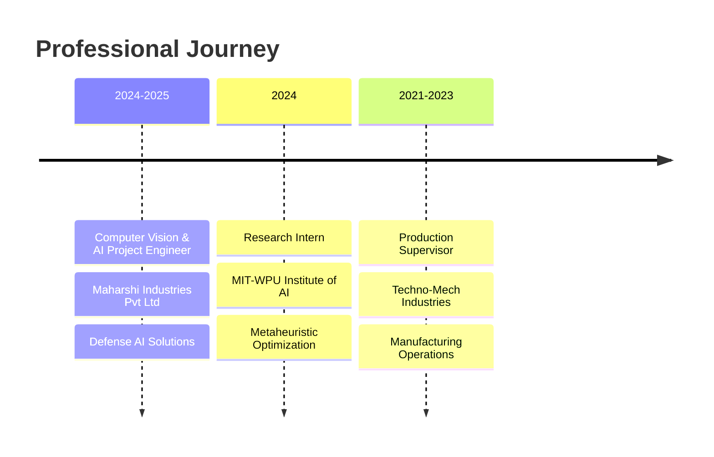

# 👋 Hello World! I'm Jainaksh Patel

<div align="center">
  
</div>

<p align="center">
  
  
</p>

---

## 🚀 About Me

> **AI Project Engineer** specializing in **Computer Vision**, **Machine Learning**, and **Defense Technology Solutions**

- 🔭 Currently working at **Maharshi Industries Pvt Ltd** on AI-driven Surveillance Systems for **DRDO, Indian Army & Indian Navy**
- 🎯 Deployed AI solutions in **Rajouri Sector** and **Kupawara near Srinagar** with Battle Field Surveillance systems
- 🏆 Achieved **25% reduction in security breaches** and **70% reduction in false alarms** through advanced AI implementations
- 🎓 **Post Graduate in AI & ML** from MIT-World Peace University with **8.56 CGPA**
- 💡 Passionate about **Computer Vision**, **GPU Optimization**, **Robotics**, and **Edge Computing**
- 🌱 Always exploring cutting-edge technologies in **AI**, **Deep Learning**, and **IoT**
- 📫 Reach me at: **jainaksh.1998@gmail.com**

---

## 🛠️ Tech Stack & Skills

### 🔥 Core Technologies
<p align="center">
  
</p>

### 🧠 AI/ML & Data Science
<p align="center">
  
</p>

<p align="center">
  
  
  
  
  
  
</p>

### ☁️ Cloud & Databases
<p align="center">
  
</p>

### 🔧 Development Tools
<p align="center">
  
</p>

### 🤖 Specialized Skills
<p align="center">
  
  
  
  
  
  
</p>

---

## 💼 Professional Highlights

### 🛡️ Defense & Security AI Solutions
```
🎯 AI-Driven Surveillance Systems for Defense Clients
   ├── 📊 25% reduction in security breaches
   ├── 🚨 70% reduction in false alarms  
   ├── 🔍 Real-time Human & Animal Intrusion Detection
   └── 📹 Camera Fusion with ReID Technology

🚀 Deployed Solutions
   ├── 🏔️ Rajouri Sector with 15 GR
   ├── 🏔️ Rasthiya Rifles in Kupawara near Srinagar
   ├── 📡 Battle Field Surveillance Radar Integration
   └── 🚪 ANPR & Facial Recognition Systems
```

### 🤖 Custom AI Models Developed
- **📱 Person using Phone Detection** - Custom CNN Architecture
- **🔫 Gun Detection System** - Real-time threat identification
- **😴 Drowsiness Detection** - Driver safety monitoring
- **🚗 Driver Management System (DMS)** - 30% accident reduction for Indian Railways

### 🔬 Hardware Solutions
- **NVIDIA Jetson AGX Orin Industrial** implementations
- **LoRaWAN-based Smart Wearables** for DMSRD
- **High-performance GPU Server Racks** for real-time AI inference

---

## 📊 GitHub Analytics

<div align="center">
  
  
</div>

<div align="center">
  
</div>

<div align="center">
  
</div>

---

## 🎯 Featured Projects

### 🔍 AI-Powered Surveillance & Security
- **Multi-modal Sensor Integration** for defense applications
- **Real-time Alert Systems** with advanced anomaly detection
- **Behavioral Pattern Recognition** for threat assessment

### 🌾 Agricultural AI Solutions
- **Weed Classification in Soybean Agriculture** using CNN models
- Performance comparison: VGG16, ResNet, Inception, Xception
- **Best Performance: ResNet** architecture

### 📰 NLP & Information Processing
- **Fake News Detection System** using advanced NLP techniques
- **Machine Learning Models**: Logistic Regression, SVM, Naive Bayes
- **TF-IDF Vectorization** with cross-validation optimization

### 🤝 Recommendation Systems
- **AI-Powered Matchmaking** using K-Nearest Neighbors
- Advanced feature selection and compatibility algorithms
- User preference analysis and recommendation optimization

---

## 🏆 Achievements & Certifications

<div align="center">

| 🎖️ **Certification** | 🏢 **Issuing Organization** |
|:---:|:---:|
| **Industrial Training Program** | L&T, Vadodara |
| **Geometric Dimensioning & Tolerancing** | Nirma University |
| **AutoCAD Mechanical Design** | Inside Redink Institute |
| **Project Management** | UCI |
| **Python Certificate** | HackerRank |
| **Image Processing with MATLAB** | MATLAB |

</div>

---

## 📈 Experience Timeline



---

## 🌐 Connect With Me

<p align="center">
  <a href="mailto:jainaksh.1998@gmail.com">
    
  </a>
  <a href="https://linkedin.com/in/jainaksh-patel">
    
  </a>
  <a href="https://github.com/Patel-Jainaksh">
    
  </a>
  <a href="tel:+919978679723">
    
  </a>
</p>

---

## 💭 Philosophy

<div align="center">
  
</div>

---

<div align="center">
  
</div>

<div align="center">
  <h3>⚡ "Building the future with AI, one algorithm at a time" ⚡</h3>
  <p><em>Thank you for visiting my profile! Let's connect and build something amazing together! 🚀</em></p>
</div>
